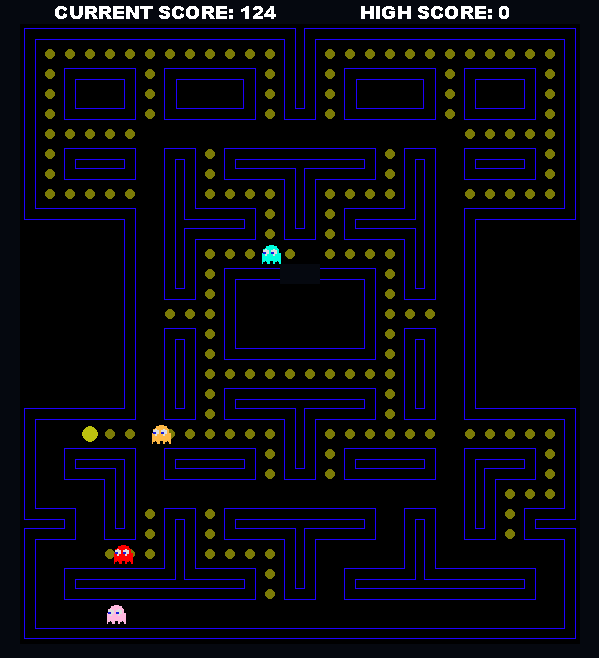
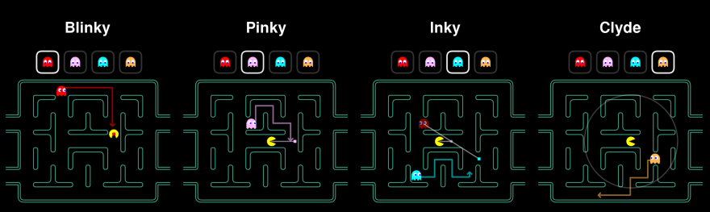

# Pacman



This is a classic recreation of the Pacman arcade game, built from scratch using Python and Pygame. The game features fully implemented gameplay mechanics including:

- Player-controlled Pacman navigating a maze

- Collectible dots and power pellets

- Score tracking

- Win and lose conditions

- Smart ghost AI with distinct behaviors (see below for detailed ghost logic)

The maze layout, collision detection, and animations are faithfully recreated, while the ghost behaviors are programmed to closely mimic the original game’s unique personalities (e.g., chase, scatter, and frightened modes).

## Maze Ghost AI Behaviors

- **Blinky**: Follows Pacman directly
- **Pinky**: Chases towards the spot 2 Pac-Dots in front of Pacman
- **Inky**: His target is relative to both Blinky and Pacman, where the distance Blinky is from Pinky's target is doubled to get Inky's target.
- **Clyde**: Chases directly after Pacman if outside 8-Dot radius of Pacman. Otherwise moves toward bottom left corner. 

## Installation Instructions
### Step 1: Get the code
```bash
git clone https://github.com/mattjacobs23/Pacman.git
cd Pacman
```

### Step 2: Set Up a Virtual Environment (Recommended)
```bash
# Create a virtual environment
python -m venv venv

# Activate the virtual environment
# On Windows:
venv\Scripts\activate

# On Mac:
source venv/bin/activate
```

### Step 3: Install Requirements
```bash
pip install -r requirement.txt
```

### Step 4: Run the Game
```bash
python main.py
```

#### Controls
- Press `SPACE` to start the game
- Use arrow keys to control Pacman
